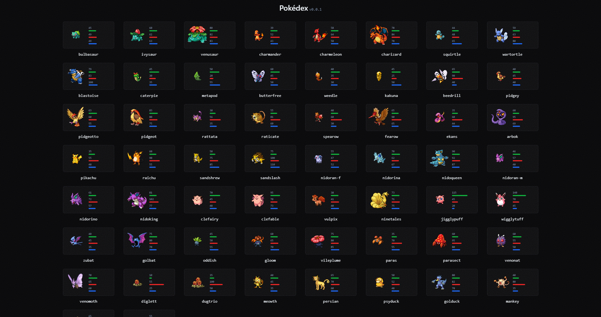

# Pokédex

## Screenshot



## To do

### Vi

- [x] Cuộn trang vô hạn.
- [ ] Đôi khi trùng lặp `prop` [`key`](https://github.com/shenlong616/pokedex/blob/4efe2a0b9a39acbcbb3ac8387161a05743626275/components/Pokedex/index.jsx#L58).
- [ ] Chỉ render khi `state1.index <= new Pokedex().getPokemonsList().count`.
- [ ] Dữ liệu qá lớn ([`state1.render`](https://github.com/shenlong616/pokedex/blob/4efe2a0b9a39acbcbb3ac8387161a05743626275/components/Pokedex/index.jsx#L13)) => gây ra tình trạng `lag` => cân nhắc dùng [react-window](https://www.npmjs.com/package/react-window).
- [ ] Khi cuộn trang đc một ít và `Dialog` component đc mở, thì thằng loz [`state1.render`](https://github.com/shenlong616/pokedex/blob/4efe2a0b9a39acbcbb3ac8387161a05743626275/components/Pokedex/index.jsx#L37) lại `re-render` nữa (vcl) => chớp nháy trên đt => `React.memo()`??
- [ ] `Search bar` component.
- [ ] `Filter` component.

## Main files

### Tree

```text
components
 ┣ Layout
 ┃ ┣ Footer.jsx
 ┃ ┣ Header.jsx
 ┃ ┣ index.jsx
 ┃ ┗ Slideout.jsx
 ┣ Pokedex
 ┃ ┣ components
 ┃ ┃ ┣ Card
 ┃ ┃ ┃ ┣ index.jsx
 ┃ ┃ ┃ ┗ Stat.jsx
 ┃ ┃ ┗ Dialog.jsx
 ┃ ┗ index.jsx
 ┗ NoiseTexture.jsx

pages
 ┣ index.jsx
 ┣ _app.jsx
 ┗ _document.jsx

README
 ┗ img
 ┃ ┗ 0.png

styles
 ┣ globals.scss
 ┣ _selectors.scss
 ┗ _tailwindcss.scss
```

## Install command

```text
 _______________
/ $ mpm i       \
\ $ npm run dev /
 ---------------
        \   ^__^
         \  (oo)\_______
            (__)\       )\/\
                ||----w |
                ||     ||
```
