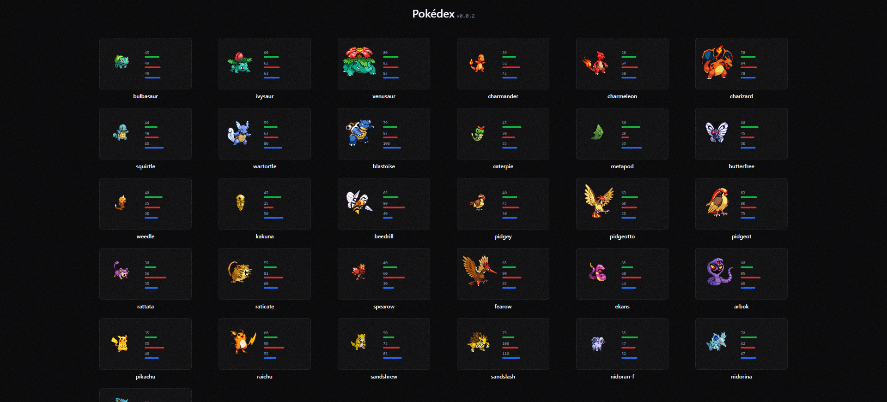
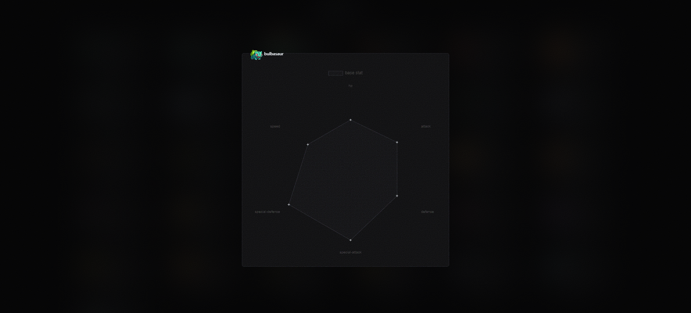

# Pokédex

## Screenshot




## To do

### Vi

- [x] Cuộn trang vô hạn.
- [ ] Phân trang.
- [ ] Đôi khi trùng lặp prop [`key`](https://github.com/shenlong616/pokedex/blob/4efe2a0b9a39acbcbb3ac8387161a05743626275/components/Pokedex/index.jsx#L58).
- [ ] Chỉ render khi `state1.index` bé hơn hoặc bằng `new Pokedex().getPokemonsList().count`.
- [ ] Dữ liệu qá lớn ([state1.render](https://github.com/shenlong616/pokedex/blob/4efe2a0b9a39acbcbb3ac8387161a05743626275/components/Pokedex/index.jsx#L13)) => gây ra tình trạng `lag` => cân nhắc dùng [react-window](https://www.npmjs.com/package/react-window).
- [ ] Khi cuộn trang đc một ít và `Dialog` component đc mở, thì thằng loz [state1.render](https://github.com/shenlong616/pokedex/blob/4efe2a0b9a39acbcbb3ac8387161a05743626275/components/Pokedex/index.jsx#L37) lại `re-render` nữa (vcl) => chớp nháy trên đt => `React.memo()`??
- [ ] `Search bar` component.
- [ ] `Filter` component.
- [x] Sử dụng [`swr`](https://swr.vercel.app/) thay cho [`pokedex-promise-v2`](https://github.com/PokeAPI/pokedex-promise-v2)
- [ ] Component hóa từng thành phần.
- [ ] Sử dụng [`Image`](https://nextjs.org/docs/api-reference/next/image) component. => Nhưng phải loại bỏ 2 props `height` và `weight`. => `https://nextjs.org/docs/api-reference/next/image#fill`
- [x] Buộc dùng [`concat`](https://github.com/shenlong616/pokedex/blob/c9c3a88b81f99cd0a2371392a845f5a6a0f8ff76/components/Pokedex/index.jsx#L53) method thay cho toán tử `spread` => Vì nhanh hơn chứ cái loz j nữa. => `https://stackoverflow.com/questions/48865710/spread-operator-vs-array-concat`

### En

- [x] Tôi không biết tiếng Anh :)

## Tree file

### Main files

```text
components
 ┣ Layout
 ┃ ┣ Footer.jsx
 ┃ ┣ Header.jsx
 ┃ ┣ index.jsx
 ┃ ┗ Slideout.jsx
 ┣ Pokedex
 ┃ ┣ components
 ┃ ┃ ┣ Card.jsx
 ┃ ┃ ┣ Dialog.jsx
 ┃ ┃ ┗ ProgressBar.jsx
 ┃ ┗ index.jsx
 ┗ NoiseTexture.jsx

hooks
 ┗ usePokemon.js

pages
 ┣ index.jsx
 ┣ _app.jsx
 ┗ _document.jsx

README
 ┗ img
 ┃ ┗ 0.png

styles
 ┣ globals.scss
 ┣ _scrollbar.scss
 ┣ _selectors.scss
 ┗ _tailwindcss.scss
```

### Configuration files

```text
pokedex
 ┣ pokedex.config.js // Basic configuration! (style, animation,...)
 ┗ ...
```

## Install command

```text
 _______________
/ $ mpm i       \
\ $ npm run dev /
 ---------------
        \   ^__^
         \  (oo)\_______
            (__)\       )\/\
                ||----w |
                ||     ||
```
