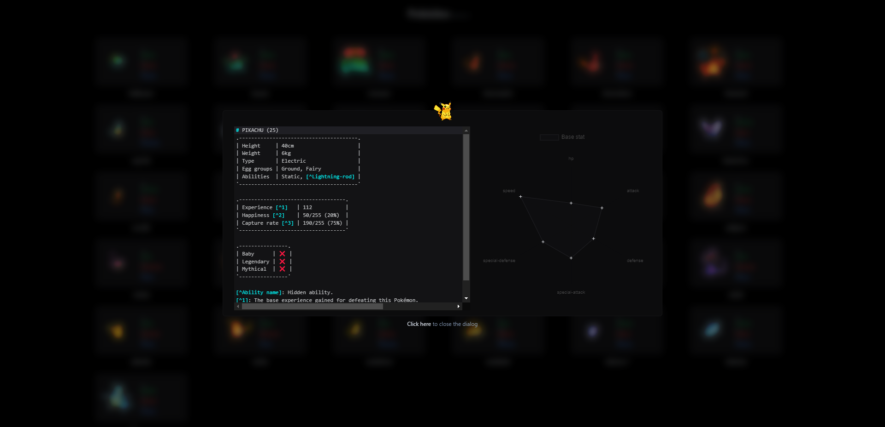
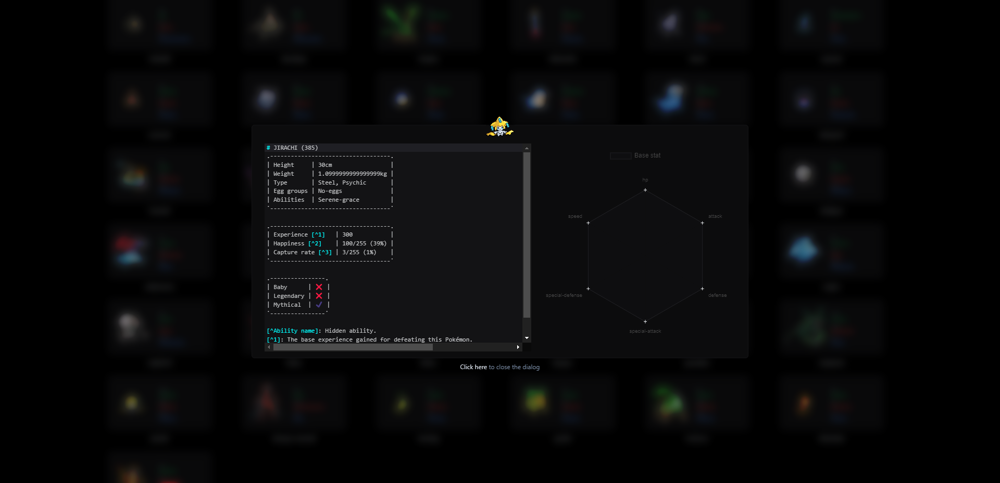

# Pokédex

## Screenshots





## To do

- [x] Infinite page scroll
- [ ] Pagination
- [x] Render only when `state1.index` is less than or equal to [`{count:{}}`](https://pokeapi.co/api/v2/pokemon/)
- [ ] Data `state1.render` is too large => causing `lag` => learn about [`react-window`](https://www.npmjs.com/package/react-window)
- [ ] `Search` component ([`Debounce`](https://streamich.github.io/react-use/?path=/story/side-effects-usedebounce--docs))
- [ ] `Filter` component
- [x] Use [`swr`](https://swr.vercel.app/) instead of [`pokedex-promise-v2`](https://github.com/PokeAPI/pokedex-promise-v2)
- [ ] Separate `components`
- [ ] When using [`Image`](https://nextjs.org/docs/api-reference/next/image) component => dont use props `height` and `weight`
- [x] `Flex` display
- [x] `Grid` display
- [ ] Use [`useContext`](https://codesandbox.io/s/react-context-hq0sm8) to transport `data` between `components`
- [ ] Offline [`data`](https://github.com/PokeAPI/pokeapi) 🤡
- [ ] [`Dynamic`](https://nextjs.org/docs/routing/dynamic-routes) routes
- [ ] [`@layer`](https://tailwindcss.com/docs/functions-and-directives#layer)
- [ ] [`Code splitting`](https://reactjs.org/docs/code-splitting.html)

## Notes

- [x] Limit creation of unnecessary html tags `div, span,...`
- [x] When using `swr` there is no need for `async function(await function() {})`
- [x] Forced to use [`concat method`](/components/Pokedex/index.jsx#L63) instead of `spread operator` => because it's faster :v => [`document`](https://stackoverflow.com/questions/48865710/spread-operator-vs-array-concat)
- [x] Update `Next.js` version from 12 to 13

## Known bugs

### Mobile

- [ ] Component `Card` has no `background color`
- [ ] Component `Dialog` and `NoiseTexture` not good 😣

### ?🙂?

- [ ] There are no focusable elements inside the `<FocusTrap />`
- [ ] Cannot update a component (`__WEBPACK_DEFAULT_EXPORT__`) while rendering a different component (`InView`). To locate the bad setState() call inside `InView`

## Tree files

```text
📂components
 ┣ 📂Layout
 ┃ ┣ Footer.jsx
 ┃ ┣ Header.jsx
 ┃ ┣ index.jsx
 ┃ ┗ Slideout.jsx
 ┣ 📂Pokedex
 ┃ ┣ 📂Dialog
 ┃ ┃ ┣ CloseText.jsx
 ┃ ┃ ┣ Description.jsx
 ┃ ┃ ┣ index.jsx
 ┃ ┃ ┗ Legend.jsx
 ┃ ┣ Card.jsx
 ┃ ┣ index.jsx
 ┃ ┗ ProgressBar.jsx
 ┣ CodeMirror.jsx
 ┗ NoiseTexture.jsx

 📂function
 ┣ _function1.js
 ┗ _function2.js

📂hooks
 ┗ useSWR.js

📂pages
 ┣ index.jsx
 ┣ _app.jsx
 ┗ _document.jsx

 📂README
 ┗ 📂images
 ┃ ┗ 📂screenshots
 ┃ ┃ ┣ 📜1.png
 ┃ ┃ ┣ 📜2.png
 ┃ ┃ ┗ 📜3.png

📂styles
 ┣ globals.scss
 ┣ _codemirror.scss
 ┗ _tailwindcss.scss
```

## Development

```text
 _______________
/ $ mpm i       \
\ $ npm run dev /
 ---------------
        \   ^__^
         \  (oo)\_______
            (__)\       )\/\
                ||----w |
                ||     ||
```
